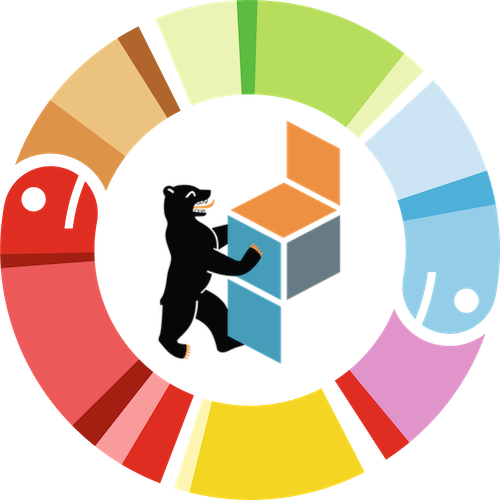

Unlocking Information - 
Creating Synthetic Data for Open Access  
===
<div align="center">

</div>

This repo provides the slides and the materials
for [my talk at PyConDE/PyDataBerlin 2023]([https://www.youtube.com/watch?v=N1i_Z-WKaRs&list=PLGVZCDnMOq0peDguAzds7kVmBr8avp46K&index=14]), on Wednesday April 20th.

## To watch the slides you can follow these steps. 
You need to have Python 3.10 and uv installed.

### Clone the repository and navigate to the directory

Use git clone or your preferred method to download/clone the repo.


### Installation with uv

Navigate to your project directory and do:

```bash
uv venv --python 3.10
```
```bash
source .venv/bin/activate
```
```bash
uv pip install -r requirements.txt
```

### Start the presentation

Just run:

```bash
streamlit run 🔓_Synthetic_Data.py
```

You should see the first slide with the title:
Unlocking Information - 
Creating Synthetic Data for Open Access

### Additional material

Find accompanying notebooks in the demo_notebook folder

